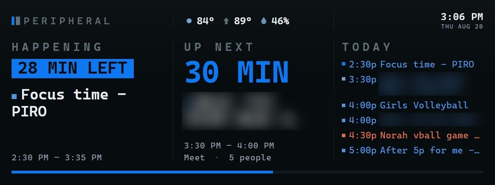

# Peripheral

**Your life, in the corner of your eye.**

An ambient calendar-and-weather panel for a $38 USB LCD. Shows what's
actually next — with a live countdown — on a 1280×480 screen sitting on your
desk. No cloud, no account beyond your own Google Calendar, no telemetry.
Your calendar token never leaves the machine.



*The agenda pane, captured the same way the daemon captures it for the
physical panel — real calendar and weather data, three meeting titles
blurred at Ricky's request before this went in the README (nothing else
about the layout or data is altered). Not yet a photo of the physical glass
on a desk; if that ever replaces this, `docs/**/*.jpg` is already exempted
from `.gitignore` for it.*

> Status: **working, daily driver.** Real calendar (work + personal, merged
> server-side), live weather, colour-coded by calendar, running unattended
> since 2026-08-17. See [`CHANGELOG.md`](CHANGELOG.md) for the day-by-day
> history and [`directives/roadmap.md`](directives/roadmap.md) for what's
> still ahead — a colour picker, public-repo polish, and a second panel size.

## Hardware

[Thermalright Trofeo Vision LCD 6.86"](https://www.amazon.com/dp/B0GYKJZT2F) —
$37.90, 1280×480, USB-C, magnetic back.

**It is not a monitor.** It enumerates as a USB HID device (`0416:5302`) and you
push JPEG frames to it. Your OS will never show it as a second display. Skip the
bundled TRCC software entirely.

Buyer beware: 3.7★/145 with a real pattern of flicker-then-death inside a couple
of months, and disconnects that a better USB-C cable fixes. Peripheral is built
so a dead panel costs you a screen, not the setup — the same page opens in any
browser, and the transport runs on its own thread specifically so a wedged USB
endpoint can't take the rest of the daemon down with it (see `CHANGELOG.md`,
2026-08-18, for the incident that proved it necessary).

## What it shows

- **Today's agenda**, work and personal calendars merged into one list — a
  live countdown to what's next, colour-coded by which calendar it's on.
- **Weather** in the header — current temp, today's high, precipitation
  chance — from the free, keyless US National Weather Service API. No API
  key, no signup, no recurring cost.
- **Overlap handling** that isn't just "whichever event is first" — a
  concurrent meeting and a longer commitment resolve by which one you're
  actually *in*, not which one is technically bigger. Personal-calendar
  events are demoted unless clearly claimed by name or a matching work block.

## How it works

The daemon serves the panes over loopback and **screenshots its own URL** to
produce frames. One renderer, two consumers:

```
  web/panes/agenda/  ──►  http://127.0.0.1:4780  ──┬─►  Playwright ─► JPEG ─► HID panel
                                                    └─►  your browser (design + fallback)
```

That's the whole trick. It means you iterate on the design in Chrome at true
size, and it means the fallback path is the same code as the real path — so it
can't quietly rot. If the panel ever dies, the same URL still works in any
browser tab.

## Quick look, no hardware and no Google account needed

```bash
npm i
node src/server.js
```

Open <http://127.0.0.1:4780/panes/agenda/> at 1280×480. With no daemon running
there's no `/api/state`, so the pane falls back to mock events anchored to your
real clock — the countdown ticks and the layout is honest.

## Setup, if you own the same panel

```bash
npm i
npm run setup
```

`npm run setup` does everything that CAN be scripted: creates `.env` from the
template, regenerates the colour palette from your current wallpaper, and
probes for the panel over USB. It prints the ordered steps for what's left —
there is exactly one unavoidable manual step, because Google doesn't offer an
API to create an OAuth client for you:

1. **Google Cloud Console** → new project → enable the Calendar API →
   Credentials → Create client → **Desktop app**. Paste the id/secret into
   `.env`.
2. `npm run auth` — signs you in, prints every calendar you can see with its
   real id, so you can pick which ones belong on the panel.
3. `npm run startup:install` — registers the daemon to start at logon (no
   admin required). **Verify by eye afterward** — a registered task proves
   the process started, never that the panel actually lit up.

Full reasoning for every decision along the way — why work is the primary
account, why the OAuth client has to live inside an org's Cloud project, why
the transport runs on a worker thread — is in [`CLAUDE.md`](CLAUDE.md) and
[`CHANGELOG.md`](CHANGELOG.md), not repeated here.

## The palette

Tokens are derived from your current Windows wallpaper, but **hue only.**
Lightness is forced to values that work on a small panel, then every token is
gated on contrast against the ground before it ships — per-role floors, not
one number, because a 106px countdown and a 22px agenda row have very
different legibility needs:

| Token | Floor |
|---|---|
| `--accent-cool`, `--text` | 7:1 |
| `--accent-hero` | 4.5:1 (AAA for the 106px countdown specifically) |
| `--accent-calendar-work`, `--accent-calendar-personal` | 6:1 |
| `--text-dim` | 4.5:1 |
| `--text-faint` (past events) | 3:1, deliberately below AA — low salience *is* the information |

**Wallpaper proposes, contrast vetoes, you overrule.** This is not decoration —
the screenshot that inspired this project used a photo as the background and
was genuinely unreadable. An arbitrary image cannot be trusted with anything
but hue.

**Prefer a UI to editing source?** Once the daemon is running, open
`http://127.0.0.1:4780/settings/palette/` — the colour picker previews live
against the real pane, shows the contrast ratio and floor for every choice,
and says plainly when a colour had to be lightened to pass. Nothing is
written to disk until you save.

```bash
npm run palette # rewrites web/tokens.css from your wallpaper + current env overrides
```

`web/tokens.css` is generated. Don't hand-edit it.

## Prior art

Protocol work by others, gratefully read:

- [Lexonight1/thermalright-trcc-linux](https://github.com/Lexonight1/thermalright-trcc-linux) — reverse-engineered TRCC protocol for this device family
- [christensen143/claude-trofeo-hud](https://github.com/christensen143/claude-trofeo-hud) — same panel, macOS, Python

Idea from [this thread](https://old.reddit.com/r/ClaudeAI/comments/1vk88m5/38_claude_lcd_table_display/).

## License

[MIT](LICENSE).
